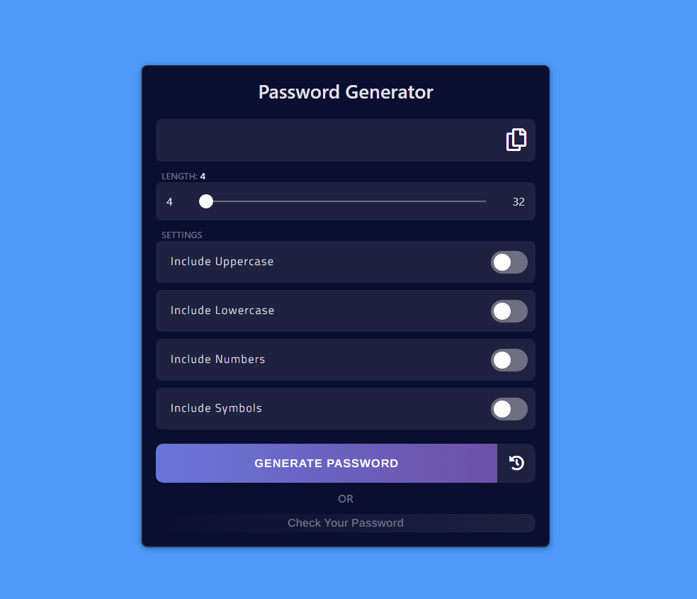
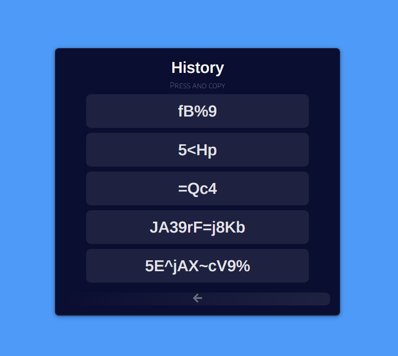
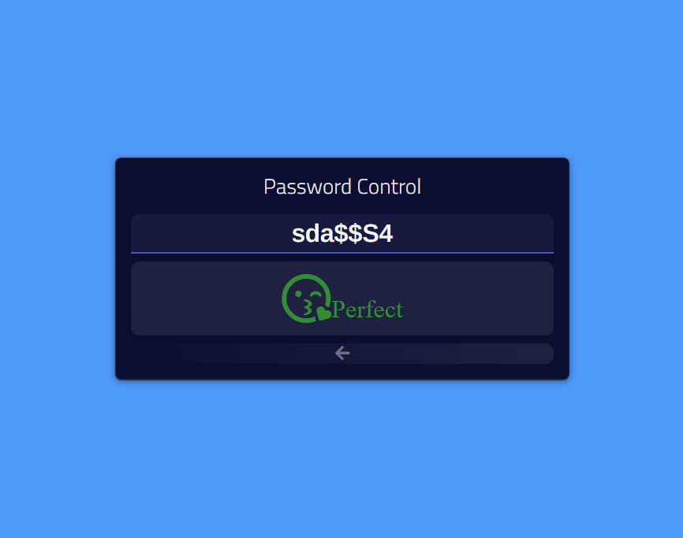

# [პროექტის ლინკი](https://gicharkviani.github.io/PassGenReactWebApp/)
----
## ყოველ ჯერზე აგენერირებს უნიკალურ პაროლს, ამასთან აქვს:
 - **საკუთარი პაროლის შემოწმებისა და**
 - **უკვე გენერირებული პაროლების ისტორიის გვერდები**
----
## ფოტოდოკუმენტაცია:
*მთავარი გვერდი:*

----
*პაროლის შემოწმების კომპონენტი:*

----
*ისტორიის კომპონენტი:*

----
## Credits:
- [React](https://reactjs.org/)
- [FontAwesome](https://fontawesome.com/)
- [Google Fonts](https://fonts.google.com/)
- [coolors](https://coolors.co/)
- [bootstrap](https://getbootstrap.com/)
